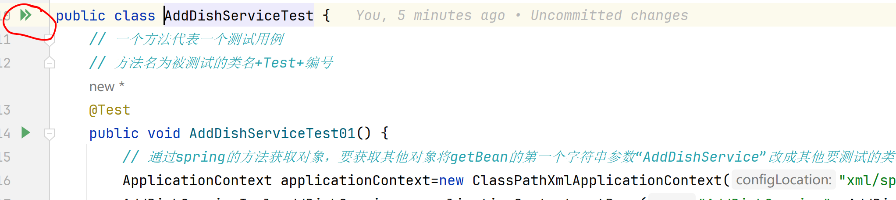
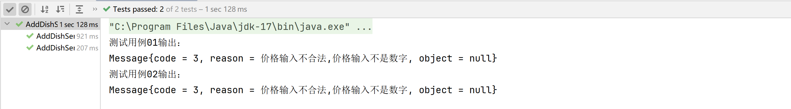

# 测试流程
### 单击此文件空白处，右上角会出现3个按钮，点击最右边的按钮进入markdown文件预览模式
如果已经是选择最右边按钮的状态下忽略此步骤
### 进入[MySQL文件](past/MySQL.sql)，复制sql语句在mysql中运行一遍
蓝字可点击跳转
### 将[配置文件](../src/main/resources/properties/jdbc-config.properties)中的jdbc.username与jdbc.password改成本电脑mysql的用户名和密码
### 1.选取测试类
这次测试仅测试service层的类

service类的返回值类型为[Message](../src/main/java/cn/edu/cugb/bean/Message.java),可跳转过去看注释
### 2.通过查看[feature-user文档](past/feature-user.md)与[feature-admin文档](past/feature-admin.md)查看该类的功能
### 3.根据分工选择文件夹，在文件夹中创建测试类
[black1文件夹](../src/test/java/test/service/black1/AddDishServiceTest.java)、
[black2文件夹](../src/test/java/test/service/black2/AddDishServiceTest.java)、
[white1文件夹](../src/test/java/test/service/white1/AddDishServiceTest.java)、
[white2文件夹](../src/test/java/test/service/white2/AddDishServiceTest.java)

链接会跳转到示例测试类，根据注释和代码创建测试类
### 4.根据课程知识分析得到测试用例
### 5.点击测试类左侧的双箭头，运行所有测试方法

### 6.运行得到测试结果,截图

### 7.完成报告
